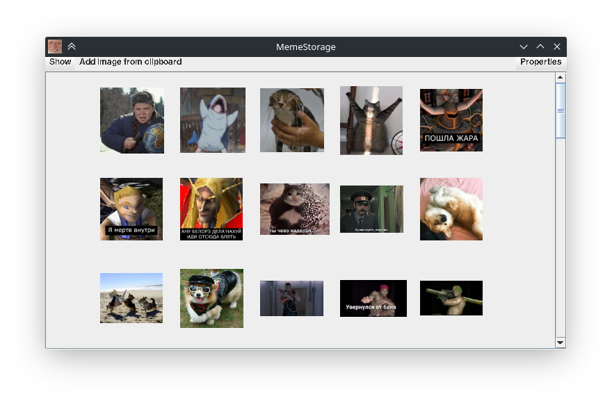

# MemeStorage
The best storage of your memes

## [Eng]
### What is it?
MemeStorage allows to save all your funny picturs in one place.
To add a picture to the collection, just save it to the clipboard and click on the button “Add image from clipboard”
To get a picture from the collection, click on its thumbnail. Then the picture will be copied to the clipboard.


When closing, MemeStorage will be minimized to tray to allow the user to quickly open the collection if necessary.

### What is the difference from an file explorer?
MemeStorage gives the user the opportunity to offer tags - words
or even whole phrases. Thanks to the tags, the user can easily find the desired picture.


### Language packages
MemeStorage supports custom language packs. At the moment, MemeStorage has only 2 language packs (English and Russian), but you can help by adding your own.


### Future updates
Future updates to MemeStorage will add:
- Create your own collection;
- Hot keys for faster user interaction;

### Build
```
javac -sourcepath ./src -d out/production/MemeStorage src/MemeStorage.java
jar -cmf manifest.mf MemeStorage.jar -C out/production/MemeStorage .
```

### Run
```
java -jar MemeStorage.jar
```
Or double click on .jar file.


## [Ru]
### Что это?
MemeStorage позволяет хранить все мемасики и смешные картинки в одном месте.
Чтобы добавить картинку в коллекцию достаточно сохранить ее в буфер обмена и нажать на кнопку "Add image from clipboard"
Чтобы получить картинку из коллекции необходимо кликнуть на ее миниатюру. Тогда картинка будет скопированна в буфер обмена.


При закрытии MemeStorage свернется в трей, чтобы дать пользователю быстро открыть коллекцию при необходимости.

### В чем отличие от обычного проводника?
MemeStorage предоставляет пользователю возможность добавлять к картинкам теги - слова
или даже целые фразы. Благодаря тегам пользователь может легко найти нужную картинку.


### Языковые пакеты
MemeStorage поддерживает пользовательские языковые пакеты. На данный момент в MemeStorage присутствуют только 2 языковых пакетов (русский и английский), но вы можете помочь, добавив свой.


### Будущие обновления
В будущих обновлениях MemeStorage добавятся:
- Создание своих коллекций;
- Горячие клавиши для более быстрого взаимодействия с пользователем;

### Сборка
```
javac -sourcepath ./src -d out/production/MemeStorage src/MemeStorage.java
jar -cmf manifest.mf MemeStorage.jar -C out/production/MemeStorage .
```

### Запуск
```
java -jar MemeStorage.jar
```
Или двойной клик по .jar файлу.
